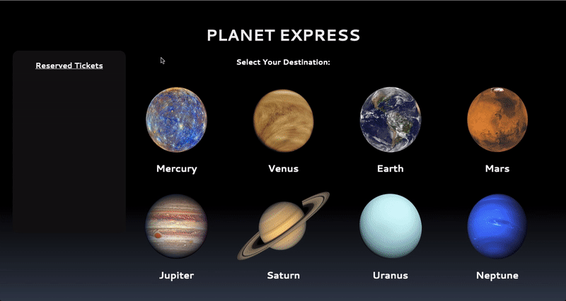

<h1 align="center">Planet Express 🚀</h1>

A `JavaScript and Rails` Web App providing tickets to the solar system with realistic orbital transfer windows and travel times. 

*** ➡️ Link to [Demo](https://www.youtube.com/watch?v=oP7dmeB0Y3E)*** 

## Technologies

***Link to [Front End Repository](https://github.com/valentinem1/Planet-Express-Frontend)*** 

**Back End:**
- Ruby [2.6.1]
- Rails [~> 6.0.2, >= 6.0.2.1] - MVC web framework used as an API
- Rack-cors - Handles Cross-Origin Resource Sharing (CORS), making cross-origin AJAX possible
- PostgreSQL [>= 0.18, < 2.0] - Database
- Active Model Serializers - Serializing API routes to JSON

**Front End:** 
- Vanilla JavaScript
- CSS3 for customization

## Prerequisites
Before you begin, ensure you have installed the latest version of:

- Ruby
- Rails
- PostgreSQL

## Installing

To launch the app you'll have to follow the following steps:

**Back End setup**
- Clone this repo and `cd` into it
- Run `bundle install` to install all required dependencies
- Ensure you have PostgreSQL up and running
- Run `rails db:create` to create the database locally
- Run `rails db:migrate` to create the tables in the database
- Run `rails db:seed` to create the seed data
- Run `rails s` to run the server

**Front End setup**
- Clone this following repo here: [Front End Repository](https://github.com/valentinem1/Planet-Express-Frontend) and `cd` into it
- Run open index.html to browse through the website.

## Features

A user, can:
   - See a list of destinations on the home page
   - Click on a destination and a card will come up allowing it to make selections to buy a ticket
   - Choose a departure date from a drop down menu which also tell the arrival time on the planet and the number of ticket left for that flight
   - Can select a number of tickets from the drop down menu and enter the passengers' names
   - Once all appropriate options are selected, the user can purchase its tickets
   - Once purchasing its ticket(s) the user can see that the quantity of tickets for the specific flight will decrease.
   - Upon deleting its ticket(s) the quantity of tickets for the specific flight will increase back.
 

 
